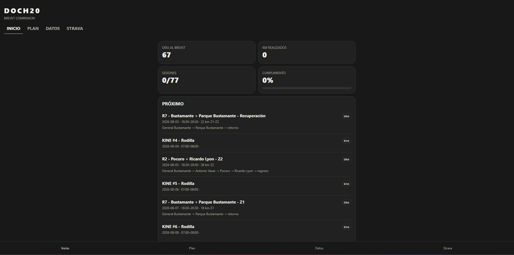

# DOCH20

**Built for the Long Ride.**

## Visión

DOCH20 es una aplicación para ciclistas de ultradistancia y randonneurs.

Su primer objetivo es acompañar la preparación para un brevet de 1.000 km el 9 de octubre de 2026.

Su objetivo principal es acompañar el camino hacia París–Brest–París 2027, 1.200 km.

## Usuario inicial

Héctor Contreras Pantoja.

- Ciclista de ultradistancia.
- Vegano.
- Preparación para PBP 2027.
- Entrena bicicleta, gimnasio y kinesioterapia.
- Necesita seguimiento específico de rodilla.
- Usa Strava y Google Calendar.

## Funciones principales

### Inicio
- Entrenamiento de hoy.
- Próximo brevet.
- Progreso semanal.
- Kilómetros planificados y realizados.
- Estado de la rodilla.
- Días restantes para PBP.

### Calendario
- Bicicleta.
- Gimnasio.
- Kinesioterapia.
- Descanso.
- Brevets.
- Sesiones AM y PM.

### Entrenamiento
- Ruta.
- Distancia.
- Tiempo.
- Zona.
- Desnivel.
- Estado realizado/no realizado.
- Datos importados desde Strava.

### Nutrición
- Carbohidratos.
- Agua.
- Sodio.
- Cafeína.
- Recordatorios durante el brevet.
- Alimentos veganos personalizados.

### Rodilla
- Dolor durante.
- Dolor después.
- Dolor al día siguiente.
- Notas.
- Historial y alertas.

### Bicicleta
- Scott Speedster 50.
- Cadena.
- Cassette.
- Pastillas de freno.
- Neumáticos.
- Historial de mantenimiento.

### Modo Brevet
- Distancia recorrida.
- Distancia restante.
- Próximo control.
- Última alimentación.
- Última hidratación.
- Cafeína acumulada.
- Tiempo total.
- Tiempo detenido.
- Modo nocturno.

### Integraciones
- Strava.
- Google Calendar.
- GPX.
- Mapas.
- Notificaciones.

## Diseño

- Nombre: DOCH20.
- Eslogan: Built for the Long Ride.
- Estilo brevet minimalista.
- Modo oscuro.
- Negro grafito.
- Amarillo como color principal.
- Interfaz inspirada en la segunda propuesta visual.